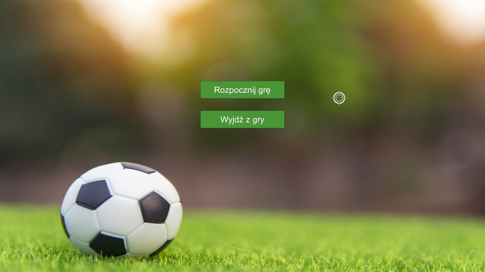
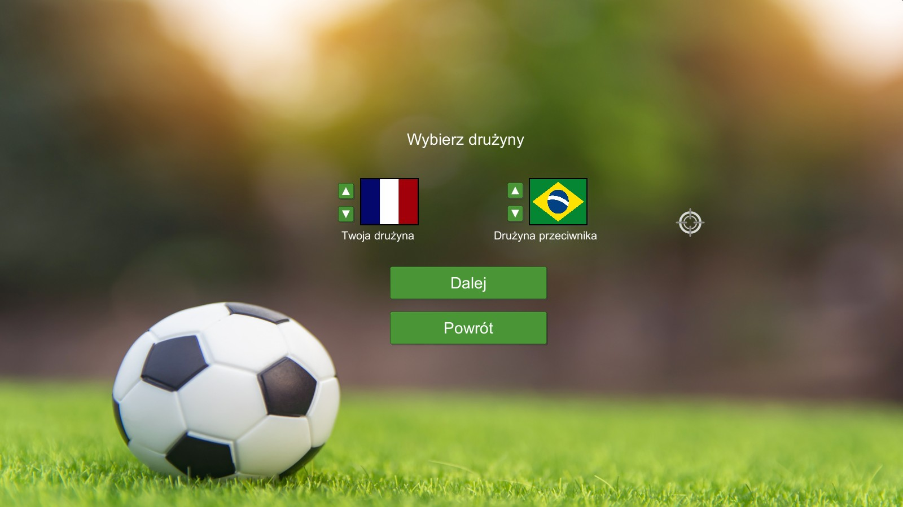
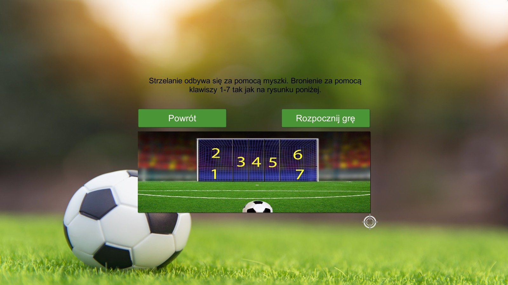
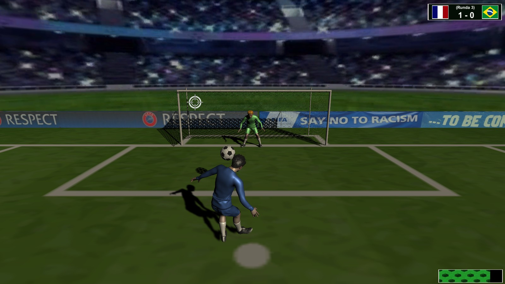
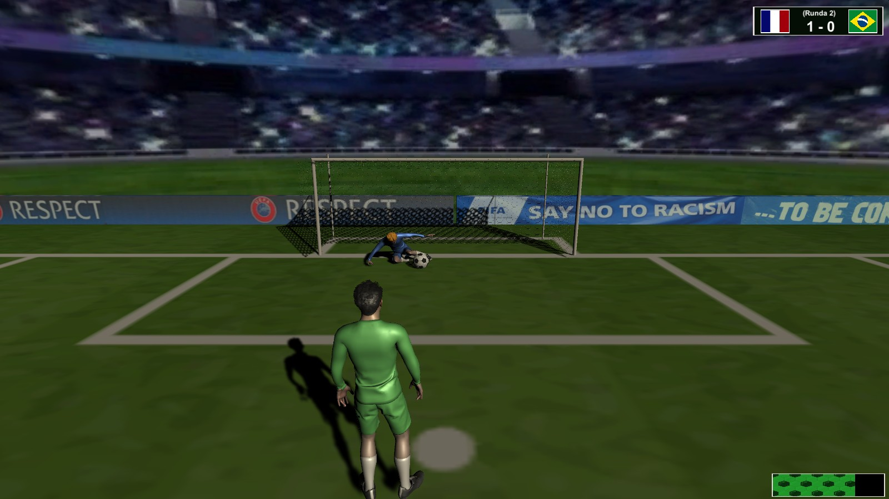

# Penaldo
Penalty shooter - simple game created within the student project. The idea of this game is to score more goals than your oponnent. When you shoot, you control your sights by mouse movement, but it is not easy to choose precisely, your cursor keeps moving in random directions. You also need to fit the force when you click on mouse. You don't want to overshoot or to kick too weakly. When there is your turn to save the goal, you need to choose one of 7 animations to protect the goal.

There are some screens from the game:

